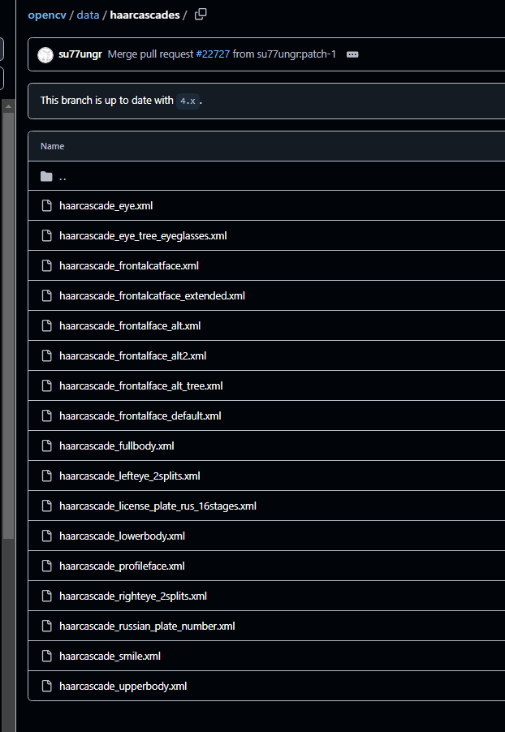

# Thatcher-effect
## Haar Cascades
Ez egy OpenCV-be beépített osztályozó, ami Haar módszerét használja és az emberi test felismerésére lett betanítva.

## Feladatmegoldás
-  Ahhoz, hogy pontosabb legyen a szemek és a száj felismerése először megkeresem az arcot, és a képnek csak azt a részén futtatom a keresésüket. A feladatmegoldáshoz ezért szükségem volt az arc, szem és szájfelismerőre.
```
mouth_cascade = cv2.CascadeClassifier('tatcher-venv/Scripts/haarcascade_mcs_mouth.xml')
eye_cascade = cv2.CascadeClassifier(cv2.data.haarcascades + 'haarcascade_eye.xml')
face_cascade = cv2.CascadeClassifier(cv2.data.haarcascades + 'haarcascade_frontalface_default.xml')
```
A szájfelismerővel gondjaim voltak, ezért azt le kellett töltenem.

-   Mint a legtöbb algoritmus az OpenCV-ben, ez is szürkeárnyalatos képet vár inputként.
```
gray_image = cv2.cvtColor(image, cv2.COLOR_BGR2GRAY)
```

-   az eredmény koordinátákat a detectMultiScale függvény futtatával kapjuk
```
faces = face_cascade.detectMultiScale(gray_image, scaleFactor=1.6, minNeighbors=8)
```
Végigpásztáz a képen, azán iteratívan a kép egyre kisebb változatán és közben objektumokat keres.
scalefactor: ekkorára csökkenti lépésenként a képet, annál pontosabb (és lassabb) minél kisebb a szám
minNeighbors: legalább ennyi szomszédos kernel találatnak kell lennie

- Ezután végigmegyek az arcokon, vagyis azok helyeineknek koordinátáin a képen. ELmenetem egy-egy változóba az arcok elhelyezkedését a képen szürkeárnyalatosban és színesben.
```
if len(faces) == 0:
    print("No faces detected.")
else:
    for (x, y, w, h) in faces:
        roi_gray = gray_image[y:y+h, x:x+w]
        roi_color = image[y:y+h, x:x+w]
```

-   Beadom a szemfelismerő algoritmusának az fekete fehér arcokat
```
eyes = eye_cascade.detectMultiScale(roi_gray, scaleFactor=1.1, minNeighbors=5)
```
-   Végigmegyek a felismert szemeken és szájakon, és a koordinátáikkal elmentem a helyüket az eredeti képen Ezután megforgatom őket.
```
eyes = eye_cascade.detectMultiScale(roi_gray, scaleFactor=1.1, minNeighbors=5)
        if len(eyes) > 0:
            for (ex, ey, ew, eh) in eyes:
                eye_roi = roi_color[ey:ey+eh, ex:ex+ew]
                eye_flipped = cv2.flip(eye_roi, 0)
                roi_color[ey:ey+eh, ex:ex+ew] = eye_flipped

        mouth = mouth_cascade.detectMultiScale(roi_gray, scaleFactor=1.8, minNeighbors=8)
        if len(mouth) > 0:
            for (mx, my, mw, mh) in mouth:
                mouth_roi = roi_color[my:my+mh, mx:mx+mw]
                mouth_flipped = cv2.flip(mouth_roi, 0)
                roi_color[my:my+mh, mx:mx+mw] = mouth_flipped
```

## Tapasztalatok
Ahhoz, hogy a program rendeltetészerűen működjön bármilyen tetszőleges képpel meg kelle valósítani egy paraméteroptimalizálást a scaleFactor és minNeighbors értékeire. A mostani értékeket az Elon Musk portréra állítottam be.